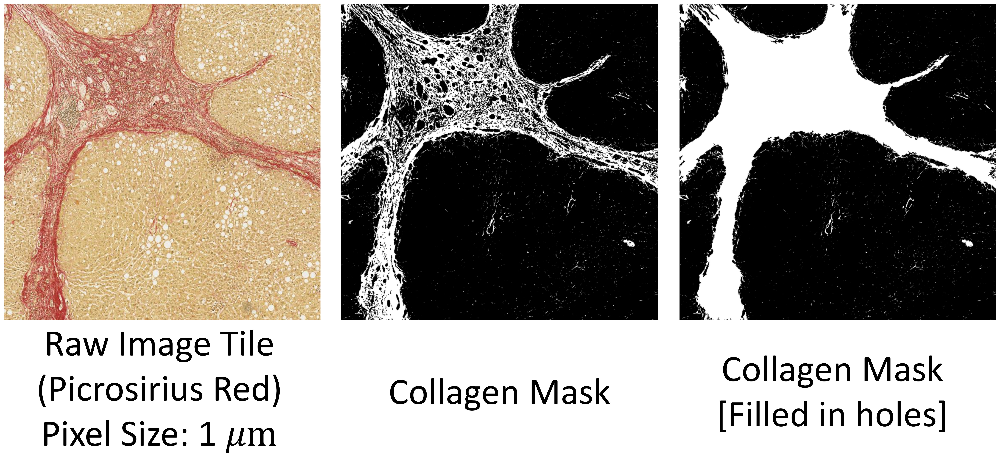

# liverquant
A python package for automated Whole Slide Image (WSI) analysis to quantitate fatty liver. The toolbox supports fat globule detection (see Example 1) and fibrosis estimation (see Example 2). We plan to extend the toolbox to quantify inflammation and ballooning in future. 

## Introduction
In digital pathology, images are often quite large and dedicated software tools like [QuPath](https://qupath.github.io/) are required to aid visualisation.

## Example 1: Detect Fat Globules
In liver pathology, the presence of fat can be indicative of various conditions, such as fatty liver disease (steatosis), which can occur in the context of alcohol abuse, obesity, diabetes, or metabolic syndrome. H&E staining (Hematoxylin and Eosin staining) is a widely used staining technique in pathology that provides basic information about tissue architecture and cellular morphology. Under H&E staining, lipids (fats) appear as clear or pale vacuoles within cells. The image tile used in this example is download from [histology page](https://gtexportal.org/home/histologyPage) with the tissue sample ID _GTEX-12584-1526_. 

To detect fat globules, use the `detect_fat_globules` function. The function first segment blobs in white. For color segmentation, you need to provide the lower and upper bounds for _Hue-Saturation-Value_ channels. Note that similar to _OpenCV_, Hue has values from 0 to 180, Saturation and Value from 0 to 255. To pick the white color, Saturation between 0 and 30 should be filtered out. Fat globules are then detected by filtering blobs based on morphological features including size, solidity, and aspect ratio.

<figure>
  
</figure>

```
import cv2 as cv
from liverquant import detect_fat_globules

# read sample image tile
img = cv.imread('./example/tile01_HE.jpg')
img = cv.cvtColor(img, cv.COLOR_BGR2RGB)

# Detect globules
mask = detect_fat_globules(img, resolution=0.4942)                                           

# Tag globules with green color                                   
img[mask == 255, :] = [5, 255, 5]

# write the tagged image
cv.imwrite('./example/tile01_HE_tagged.jpg', cv.cvtColor(img, cv.COLOR_BGR2RGB))
```

## Example 2: Collagen Segmentation
Picrosirius red (PSR) stain is a special staining technique used in liver pathology to evaluate collagen fibers. It is commonly employed to assess liver fibrosis, a condition characterized by the excessive accumulation of collagen in the liver due to chronic liver diseases such as hepatitis, alcoholic liver disease, and non-alcoholic fatty liver disease. The PSR stain selectively binds to collagen fibers, enabling their visualization under a microscope. Under a microscope, the PSR stain highlights collagen fibers as distinct red or orange-red structures. An image patch stained with PSR is provided in the example folder. 

To segment the collagen shown in red, use the `segment_by_color` function. You need to provide the lower and upper bounds for _Hue-Saturation-Value_ channels. Note that similar to _OpenCV_, Hue has values from 0 to 180, Saturation and Value from 0 to 255. To pick the red color, Hue between 0 and 10 or 170-180 should be filtered out. We have combined the two ranges into one effective range [-10, 10] in the sample code below. Since Hue is inherently periodic, negative Hue can be interpreted as positive integers by adding 180.

<figure>
  
</figure>

```
import cv2 as cv
from liverquant import segment_by_color

# read sample image tile
img = cv.imread('./example/tile02_PSR.jpg')
img = cv.cvtColor(img, cv.COLOR_BGR2RGB)

# Segment collagen using Hue-Saturation-Value channels
# To fill in holes, either set hole_size=None or increase the hole_size
mask = segment_by_color(img,
                        lowerb=[-10, 50, 100],
                        upperb=[10, 255, 255],
                        resolution=1.0124,
                        hole_size=25)

# write the tagged image
cv.imwrite('./example/tile02_PSR_mask.jpg', mask)
```